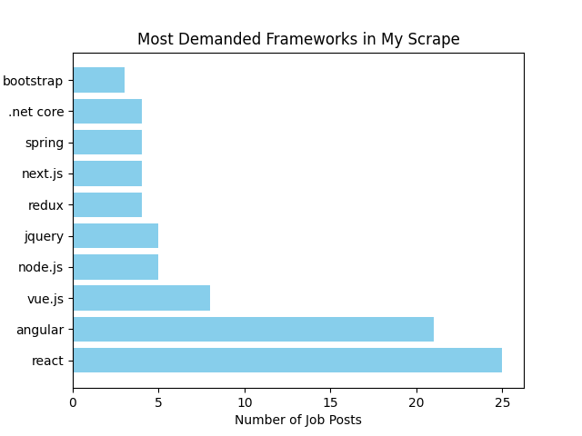

# Jobs Board Insight Tool for Tech Stack

This tool analyses a search URL of Indeed postings, scrapes the job descriptions, and compiles the descriptions into a data model which tracks the mentions of the tools, languages, and frameworks used, along with other useful information such as salary, position level, remote options, etc.

## Motivation

In preparing to re-enter the tech job market, I wanted to prioritise my learning based on data rather **than** guesswork. I built this tool to analyse real-world job postings. I want to transition to web development, so I analyse job postings for web development, and analyse the tools, languages, and frameworks used in the current job market.

## Framework Analysis

## Sample summary:

Title               : Front-end Developer
Company             : Unknown
Languages           : ['css', 'html5']
Frameworks          : ['bootstrap', 'angularjs', 'jquery']
Cloud Platforms     : []
Work Setting        : Unknown
Tools               : ['adobe creative suite', 'coreldraw graphics suite']
Min Years Experience: 0
Seniority Level     : Junior
Salary Range        : Unknown
Domain Knowledge    : []
Salary              : None

## Architecture

* **Scraping:** We use the `Playwright` library to browse the URL directly, with scripts clicking through the job postings and outputting them to a delimited plain text file.
* **Data Modeling:** We define our data model in `Pydantic`. Primarily we care about languages, frameworks, and tools, but we can see at a **glance** other interesting information points like salary or seniority of the posting.
* **LLM Integration:** We send the job posting to an LLM, in this case `Gemini`, which returns the data as a `JSON` object. We export this data to a `CSV` file.
* **Visualisation:** We have a simple visualisation process whereby we export this data on `Matplotlib` graphs.

## How to Run

This tool requires **Python** and a valid **Google Gemini API key**.

---

### Prerequisites & Installation

First, clone the repository and install the required dependencies.

* **Install dependencies:** `pip install -r requirements.txt`
* **Install Playwright browsers:** `playwright install`

---

### Configuration (API Key)

This project uses the Gemini API for text analysis. You can get a free API key from [Google AI Studio](https://aistudio.google.com/).

1. Create a file named `.env` in the project root.
2. Add your key to the file:
   `GEMINI_API_KEY=your_actual_api_key_here`

---

### Usage Guide

#### Optional: Scrape Job Postings
Run the scraper to fetch job descriptions from Indeed.
* **Command:** `python scraper.py`
* **Output:** Saves raw job descriptions to a text file. This by default is a URL that searches web developer, and scrapes 5 pages.

#### Step 2: Analyze Data (LLM Extraction)
Extract structured data (Tech Stack, Salary, etc.) from the raw text. 
> **Note:** `main.py` points to test data in data/raw testData.txt by default. It can take the file path of the raw text generated by the scrapr as an optional parameter.

* **Output:** Generates a CSV file containing the structured data. It will automatically show some pyplot graphics of the data.

## 3. Next iternation
Change the delimeter 
Make a proper visualiser 
Sort jobs by date, manage duplicate jobs
Compile similar terms ie react.js, react
